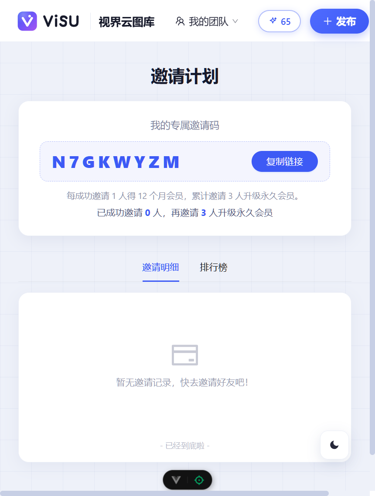
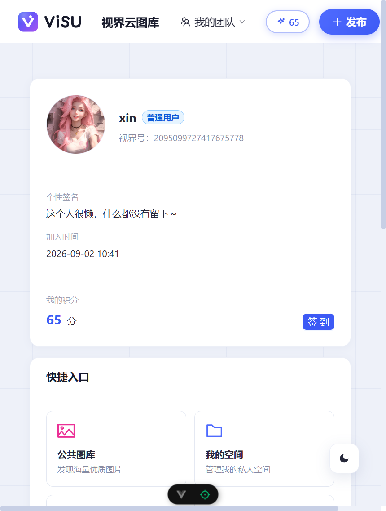
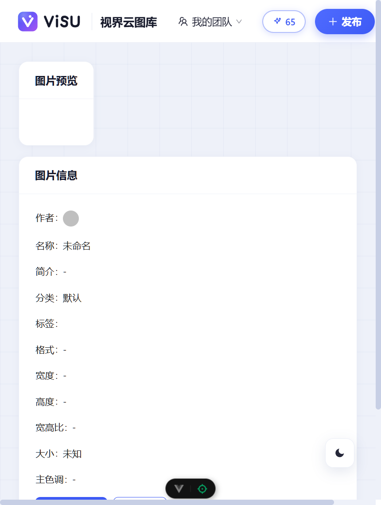
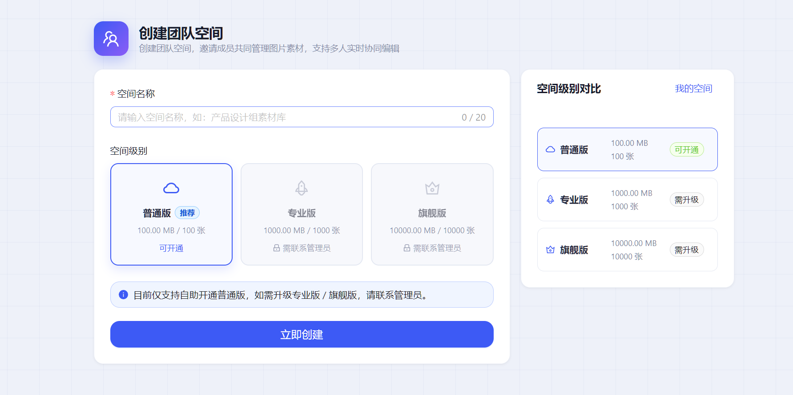
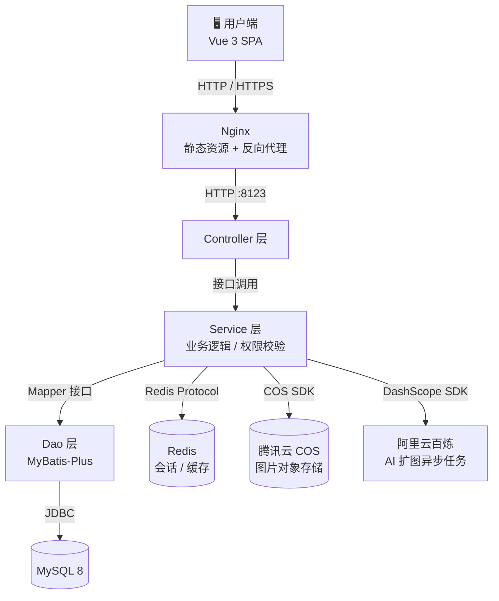

# VisU · 视界云图库 🖼️

> 一个基于 **Spring Boot 2.7 + Vue 3** 的企业级云图库协作平台：AI 扩图、团队空间协作、积分签到、邀请解锁会员，一站式图片管理与创作。

<p align="center">
  
  
  
  
</p>

---

## 📸 项目预览


| 邀请计划 | 用户中心 |
|:---:|:---:|
|  |  |
| **我的空间** | **图片详情** |
|  |  |
| **登录页** | **用户协议** |
|  |  |

---

## ✨ 功能特性

- 🖼️ **图片管理** — 上传、批量创建、关键词搜索、标签分类、审核流转
- 🤖 **AI 扩图** — 接入阿里云百炼（DashScope），异步任务轮询，结果自动打上「AI 生成」标识
- 👥 **团队协作** — 私人空间 + 团队空间，空间成员 RBAC 细粒度权限控制
- 📊 **空间分析** — ECharts 可视化：使用趋势、容量占比、成员活跃、词云
- 🎫 **邀请解锁会员** — 专属邀请码，每邀 1 人得 12 个月会员，累计 3 人升级**永久会员**，附带邀请排行榜
- 💎 **会员体系** — 批量名额、会员标签、空间容量加倍
- 🪙 **积分签到** — 每日签到攒积分，支持连续签到日历
- 📧 **邮箱验证码** — Spring Mail 驱动，60 秒防刷倒计时
- 🔐 **合规三件套** — 用户协议/隐私政策页、注册登录协议勾选、账号自助注销
- 🌗 **深色模式** — 全站适配明暗双主题

## 🛠️ 技术栈

| 层次 | 技术 |
|:---|:---|
| 前端 | Vue 3.5 · Vite · Pinia · Vue Router · Ant Design Vue 4 · ECharts · Axios |
| 后端 | Spring Boot 2.7.6 · MyBatis-Plus · Sa-Token（登录鉴权/RBAC） |
| 数据 | MySQL 8 · Redis |
| 存储 | 腾讯云 COS（对象存储） |
| AI | 阿里云百炼 DashScope（AI 扩图 out-painting） |
| 消息 | Spring Mail（邮箱验证码） |

## 🏗️ 系统架构



> **数据流向**：用户请求经 Nginx 转发至 Spring Boot，鉴权后由 Service 处理业务——图片文件写入 COS、热点数据进 Redis、业务数据落 MySQL，AI 扩图则提交百炼异步任务并轮询结果。

## 🚀 快速开始

### 环境要求

| 依赖 | 版本 | 说明 |
|:---|:---|:---|
| JDK | 11+ | 后端运行时 |
| Maven | 3.8+ | 后端构建 |
| Node.js | 18+ | 前端构建 |
| MySQL | 8.x | 业务数据库 |
| Redis | 6.x+ | 缓存与会话 |

### 1️⃣ 克隆项目

```bash
git clone https://gitee.com/whirlwind-nanny/visu-picture.git
cd visu-picture
```

### 2️⃣ 初始化数据库

```bash
# 登录 MySQL 后执行建表脚本（含全部表结构）
mysql -uroot -p
source visu-picture-backend/sql/create_table.sql
```

### 3️⃣ 配置后端

编辑 `visu-picture-backend/src/main/resources/application.yml`，填入你的真实配置：

```yaml
spring:
  datasource:
    driver-class-name: com.mysql.cj.jdbc.Driver
    url: jdbc:mysql://localhost:3306/visu?useUnicode=true&serverTimezone=Asia/Shanghai
    username: root        # 数据库用户名
    password: "你的密码"   # 数据库密码
  redis:
    database: 0
    host: localhost
    port: 6379

# 腾讯云 COS 对象存储（用于图片上传）
cos:
  client:
    host: https://你的桶名.cos.你的地域.myqcloud.com
    secretId: 你的SecretId
    secretKey: 你的SecretKey
    region: ap-shanghai

# 阿里云百炼 AI 扩图
aliyun:
  ai:
    apiKey: 你的DashScopeApiKey
```

### 4️⃣ 启动后端

```bash
cd visu-picture-backend
mvn spring-boot:run
# 后端运行在 http://localhost:8123
```

### 5️⃣ 启动前端

```bash
cd visu-picture-frontend
npm install
npm run dev
# 访问 http://localhost:5173
```

### 🐳 Docker 一键拉起依赖

不想本机装 MySQL / Redis？一条命令拉起：

```bash
docker run -d --name visu-mysql -p 3306:3306 \
  -e MYSQL_ROOT_PASSWORD=123456 -e MYSQL_DATABASE=visu mysql:8

docker run -d --name visu-redis -p 6379:6379 redis:6
```

## 📁 项目结构

```text
visu-picture
├── visu-picture-backend          # 后端服务 (Spring Boot)
│   ├── src/main/java/com/visupicture
│   │   ├── api/aliyunai          # 阿里云百炼 AI 扩图封装
│   │   ├── config                # 配置类（COS、Sa-Token、全局异常...）
│   │   ├── constant              # 常量（用户/邀请/权限...）
│   │   ├── controller            # 接口层（用户/图片/空间/分析...）
│   │   ├── manager               # COS 管理器
│   │   ├── model                 # entity / dto / vo 三层数据模型
│   │   ├── service               # 业务逻辑层
│   │   └── mapper                # MyBatis-Plus Mapper
│   └── sql
│       └── create_table.sql      # 建表脚本
└── visu-picture-frontend         # 前端应用 (Vue 3 + Vite)
    └── src
        ├── api                   # OpenAPI 生成的接口客户端
        ├── components            # 通用组件（图片列表/扩图弹窗...）
        ├── layouts               # 全局布局
        ├── pages                 # 页面（首页/空间/邀请计划/协议...）
        ├── router                # 路由（懒加载分包）
        └── stores                # Pinia 全局状态
```

## 🔌 API 接口概览

| 方法 | 路径 | 说明 |
|:---:|:---|:---|
| `POST` | `/api/user/register` | 邮箱 + 验证码注册，支持携带邀请码 |
| `POST` | `/api/user/invite/info` | 获取我的邀请信息（邀请码 / 进度 / 会员状态） |
| `POST` | `/api/picture/upload/url` | 按 URL 上传图片（AI 扩图结果携带 `isAiGenerated` 标识） |
| `POST` | `/api/picture/out_painting/create` | 创建 AI 扩图异步任务 |
| `GET` | `/api/space/analyze/usage` | 空间使用分析数据（供 ECharts 渲染） |

## 🤝 贡献指南

1. **Fork** 本仓库，从 `master` 切出功能分支：`git checkout -b feature/your-feature`
2. 提交遵循 Conventional Commits：`feat: 新增xx` / `fix: 修复xx`
3. 推送分支并发起 **Pull Request**，描述清楚改动动机与验证方式
4. 通过审查后由维护者合并回 `master`

## 📄 许可证

本项目基于 [MIT License](LICENSE) 开源，可自由使用、修改与分发。
